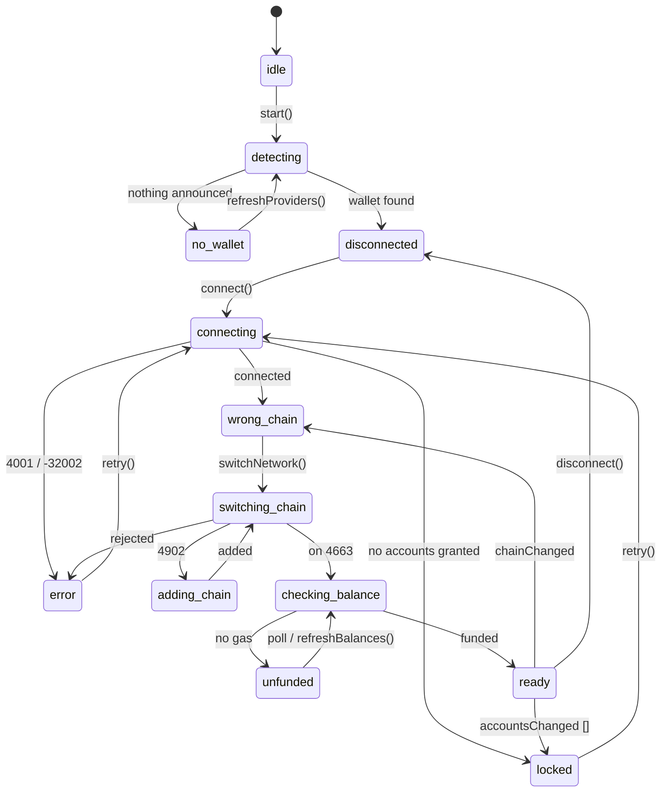

# hood-connect

**Wallet and onboarding kit for [Robinhood Chain](https://docs.robinhood.com/chain/) dApps (chain 4663 / 46630): one component for add network, fund, connect.**

A first-time visitor to a Robinhood Chain dApp almost always has a wallet, almost never has
the network added, and has a zero balance on it. Every dApp rebuilds that same three-step
onboarding, and every one of them skips the same states: no wallet installed, wallet locked,
user rejected the prompt, chain add refused, a prompt already open. `hood-connect` models the
whole thing as one exhaustive state machine and ships the UI for it, in React, in wagmi, and
as a framework-free web component.

Docs: **https://nirholas.github.io/hood-connect/**

## Why the chain parameters are the load-bearing part

Adding a network is a single RPC call whose entire contract is one object. Get a field wrong
and the wallet rejects it, silently, in every dApp that copied your snippet. MetaMask alone
rejects a zero-padded `chainId`, a currency symbol outside 2 to 6 characters, and a mismatch
between the declared chain ID and what the RPC answers to `eth_chainId`.

`hood-connect` ships both objects exactly, snapshot-tested against
[viem's official chain definitions](https://github.com/wevm/viem/blob/main/src/chains/definitions/robinhood.ts),
which is the same source wagmi and the chain's own docs agree on:

```ts
import { hoodMainnet, hoodTestnet } from 'hood-connect'

hoodMainnet.addChainParameter
// {
//   chainId: '0x1237',                                        // 4663, unpadded
//   chainName: 'Robinhood Chain',
//   nativeCurrency: { name: 'Ether', symbol: 'ETH', decimals: 18 },
//   rpcUrls: ['https://rpc.mainnet.chain.robinhood.com'],
//   blockExplorerUrls: ['https://robinhoodchain.blockscout.com'],
// }

hoodTestnet.addChainParameter.chainId  // '0xb626' (46630)
```

`tests/chains.test.ts` asserts the literal objects, the hex encoding, the symbol length
window, the absence of trailing slashes, and agreement with viem. A change to any field
fails the build rather than a user's wallet.

The second load-bearing detail is the switch itself. `wallet_switchEthereumChain` fails with
**4902** when the wallet has never heard of the chain, which is the normal case for a
first-time visitor, not an error to surface. `switchChain()` treats 4902 as the signal to
add the network and retry, and it also unwraps the `-32603` envelope several wallets bury
the real code inside.

## Install

```bash
npm install hood-connect viem
```

Node >= 20. `viem` is a peer dependency. `react`, `wagmi`, `@wagmi/core`, and
`qrcode-generator` are optional peers: install only the ones whose entry point you import.

## The state machine

Three steps, thirteen states, no unhandled branch.



| Status | Step | What the user sees |
|---|---|---|
| `idle` | connect | Nothing yet. The only status rendered on a server. |
| `detecting` | connect | Looking for a wallet. |
| `no-wallet` | connect | Install prompt plus a rescan button. |
| `disconnected` | connect | Connect button, or a picker when several wallets are installed. |
| `connecting` | connect | Waiting on the wallet prompt. |
| `locked` | connect | Unlock instructions plus retry. |
| `wrong-chain` | network | Switch button, with both chain IDs named. |
| `adding-chain` | network | Waiting on the add-network prompt. |
| `switching-chain` | network | Waiting on the switch prompt. |
| `checking-balance` | fund | Reading native and USDG balances. |
| `unfunded` | fund | Bridge routes plus a receive address and QR. |
| `ready` | done | Account summary. The dApp can transact. |
| `error` | (where it failed) | The failure, its recovery hint, and a retry. |

Because the union is exhaustive, a `switch` over it with no `default` fails to compile the
moment a state goes unhandled.

## Quickstart: React

```tsx
import { HoodConnect } from 'hood-connect/react'

export function Page() {
  return (
    <HoodConnect
      config={{ chain: 'mainnet' }}
      theme="auto"
      onReady={(state) => console.log('ready:', state.address)}
    />
  )
}
```

Headless, when you want your own markup:

```tsx
import { useHoodConnect } from 'hood-connect/react'

export function Gate() {
  const hood = useHoodConnect({ chain: 'mainnet' })

  if (hood.status === 'no-wallet') return <a href="https://ethereum.org/en/wallets/find-wallet/">Get a wallet</a>
  if (hood.status === 'wrong-chain') return <button onClick={() => hood.switchNetwork()}>Switch network</button>
  if (hood.status === 'unfunded') return <a href={hood.fundingRoutes[0]?.url}>Bridge in</a>
  if (hood.status === 'ready') return <p>Connected: {hood.address}</p>

  return <button onClick={() => hood.connect()} disabled={hood.pending !== null}>Connect</button>
}
```

## Quickstart: wagmi

The connector wagmi does not ship. Chains, transports, and the add-then-switch behaviour in
one import:

```ts
import { createHoodConfig } from 'hood-connect/wagmi'

export const config = createHoodConfig({ networks: ['mainnet'], ssr: true })
```

Or compose it yourself:

```ts
import { createConfig } from 'wagmi'
import { hoodConnector, hoodTransports, hoodWagmiChains } from 'hood-connect/wagmi'

export const config = createConfig({
  chains: hoodWagmiChains,
  transports: hoodTransports,
  connectors: [hoodConnector()],
})
```

## Quickstart: plain HTML

```html
<script type="module" src="https://unpkg.com/hood-connect/dist/element/index.js"></script>
<hood-connect chain="mainnet" theme="auto"></hood-connect>

<script type="module">
  document.querySelector('hood-connect').addEventListener('hood-connect:ready', (event) => {
    console.log('ready:', event.detail.address)
  })
</script>
```

## Funding routes

`hood-connect` does not deploy, hardcode, or call a bridge contract. Robinhood Chain is an
Arbitrum Orbit chain, so its canonical deposit path is the Arbitrum bridge portal, and the
right thing for a component to do is hand the user a route. The mainnet routes are the ones
[the chain's own bridging docs](https://docs.robinhood.com/chain/bridging/) list:

| Route | Destination |
|---|---|
| `arbitrum-canonical` | `https://portal.arbitrum.io/bridge?destinationChain=robinhood-chain&sourceChain=ethereum` |
| `relay` | `https://relay.link/bridge/robinhood` |
| `across` | `https://across.to/?to=robinhood` |
| `stargate` | `https://stargate.finance` |
| `receive` | The user's own address, plus an [EIP-681](https://eips.ethereum.org/EIPS/eip-681) URI and QR |

The `receive` route is always present and always last, on every network and every
configuration, because it is the only route that cannot break. Its URI carries `@4663`, which
is what keeps a scanned code off Ethereum mainnet. The testnet has no documented public
bridge, so on testnet `receive` is the only default route: supply your own with
`funding.routes` rather than expecting one to appear.

```ts
createOnboarding({
  funding: {
    extraRoutes: [
      { id: 'ours', label: 'Buy with card', kind: 'bridge', description: 'Our onramp', url: 'https://example.com', official: false },
    ],
  },
})
```

## API

### Core (`hood-connect`)

| Export | What it does |
|---|---|
| `createOnboarding(config)` | The state machine. Returns `{ getState, subscribe, start, connect, addNetwork, switchNetwork, refreshBalances, retry, disconnect, destroy, ... }` |
| `deriveStatus(context, target)` | The pure status function the machine uses. Total and testable. |
| `createProviderStore(options)` | EIP-6963 discovery. SSR-safe, reference-stable snapshots. |
| `hoodMainnet` / `hoodTestnet` | Chain metadata plus the exact `addChainParameter`. |
| `resolveHoodChain(4663 \| 'mainnet')` | Chain lookup by ID or alias. |
| Wallet primitives | `requestAccounts`, `getAccounts`, `getChainId`, `addChain`, `switchChain`, `watchAccounts`, `watchChain`, `watchDisconnect`, `revokePermissions` |
| `readBalances(source, chain, address)` | Native and USDG balances over a provider or an HTTP RPC. |
| `buildFundingRoutes(chain, address, options)` | The funding routes for a chain and account. |
| `buildView(state, options)` | The pure state-to-UI projection both renderers use. |
| `HoodConnectError` | Normalised failure with `.code`, `.hint`, `.retryable`, `.providerCode`. |

`OnboardingConfig`: `chain`, `rpcUrl`, `requireFunding`, `minNativeWei`, `autoConnect`,
`autoSwitchChain`, `funding`, `storage`, `storageKey`, `balanceRefreshIntervalMs`,
`includeLegacyWindowEthereum`, `detectionTimeoutMs`.

Every action resolves with the new state and never rejects on a wallet-level failure, so a
click handler cannot produce an unhandled rejection. Failures land in `state.error`.

### React (`hood-connect/react`)

| Export | Signature |
|---|---|
| `<HoodConnect />` | See the prop table below |
| `<HoodConnectProvider config>` | Shares one machine across a tree |
| `useHoodConnect(config?)` | Full state plus bound `connect` / `switchNetwork` / `addNetwork` / `refreshBalances` / `retry` / `disconnect` / `refreshProviders` / `clearError` |
| `useProviders(config?)` | The discovered wallets |
| `useOnboardingStatus(config?)` | Just the status |

| Prop | Type | Default | Notes |
|---|---|---|---|
| `config` | `OnboardingConfig` | `{}` | Read once, on first render |
| `theme` | `'auto' \| 'light' \| 'dark'` | `'auto'` | `auto` follows `prefers-color-scheme` |
| `unstyled` | `boolean` | `false` | Drops the stylesheet, keeps the markup and ARIA |
| `className` | `string` | | Added to the root |
| `labels` | `ViewLabels` | | Overrides for every string rendered |
| `installUrl` | `string` | ethereum.org wallet finder | Where a user with no wallet is sent |
| `showDisconnect` | `boolean` | `true` | |
| `showQrCode` | `boolean` | `true` | Needs the optional `qrcode-generator` peer |
| `onStatusChange` | `(status, state) => void` | | Every transition |
| `onReady` | `(state) => void` | | Once per arrival at `ready` |
| `onError` | `(error, state) => void` | | Every new error |

### wagmi (`hood-connect/wagmi`)

`hoodConnector(params)`, `createHoodConfig(params)`, `hoodWagmiChains`, `hoodTransports`,
`robinhoodChain`, `robinhoodChainTestnet`.

### Web component (`hood-connect/element`)

Attributes: `chain`, `theme`, `rpc-url`, `auto-connect`, `auto-switch-chain`,
`require-funding`, `min-native-wei`, `install-url`, `show-qr`, `show-disconnect`, `unstyled`.

Events (all bubble and cross the shadow boundary): `hood-connect:status`,
`hood-connect:ready`, `hood-connect:account`, `hood-connect:error`. The machine is on the
element as `.onboarding`, the snapshot as `.state`.

## Theming

Every colour is a CSS custom property on `.hc-root`. Override the ones you care about:

```css
.hc-root {
  --hc-accent: #6d5efc;
  --hc-radius: 8px;
  --hc-font: 'Inter', sans-serif;
}
```

Full list: `--hc-bg`, `--hc-bg-inset`, `--hc-border`, `--hc-border-strong`, `--hc-text`,
`--hc-text-dim`, `--hc-text-faint`, `--hc-accent`, `--hc-accent-text`, `--hc-accent-soft`,
`--hc-danger`, `--hc-danger-soft`, `--hc-focus`, `--hc-shadow`, `--hc-radius`,
`--hc-radius-sm`, `--hc-gap`, `--hc-font`, `--hc-mono`.

For total control, `unstyled` keeps the markup, the `hc-` classes, and the ARIA wiring and
drops only the stylesheet.

## Examples

```bash
npm install
npm run build

npm run example:react   # Vite + React, both the component and the headless hook
npm run example:html    # the web component on a plain page, no bundler
```

See [INTEGRATION.md](./INTEGRATION.md) for wiring into Next.js, Vite, wagmi, and a plain page.

## Limits and caveats

- **Balances read through the connected wallet by default.** That is correct by construction
  once the wallet is on the target chain and it needs no CORS allowance, but it means no
  balance is read while the wallet is elsewhere. Pass `rpcUrl` to read over HTTP instead.
- **`wallet_revokePermissions` is a MetaMask extension, not a standard.** `disconnect({ revoke: true })`
  resolves either way; on a wallet without it the session is only dropped locally.
- **A wallet with no `wallet_addEthereumChain` cannot be onboarded from a website.** The flow
  reports `unsupported-method`, marks it non-retryable, and tells the user to switch manually.
  Some mobile in-app browsers behave this way.
- **The QR code needs the optional `qrcode-generator` peer.** Without it the funding step
  still renders the address, the copy button, the explorer link, and the EIP-681 URI. On a
  page with no bundler, one UMD script tag is enough: the loader checks the global first.
- **No bridge contract is called.** Funding routes are links. Nothing in this package moves
  funds, signs a transaction, or holds a key.
- **Testnet has no documented public bridge.** `receive` is the only default route there.
- **`config` is read once per machine.** To retarget a different network, remount the
  component (see `examples/react/src/App.tsx`) or create a new machine.

## Related

Part of the Robinhood Chain fleet: [`hoodchain`](https://github.com/nirholas/hoodchain) (SDK),
[`hoodkit`](https://github.com/nirholas/hoodkit) (streams, indexer, hooks),
[`hood402`](https://github.com/nirholas/hood402) (x402 payments over USDG).

## License

Proprietary, all rights reserved. See [LICENSE](./LICENSE).
